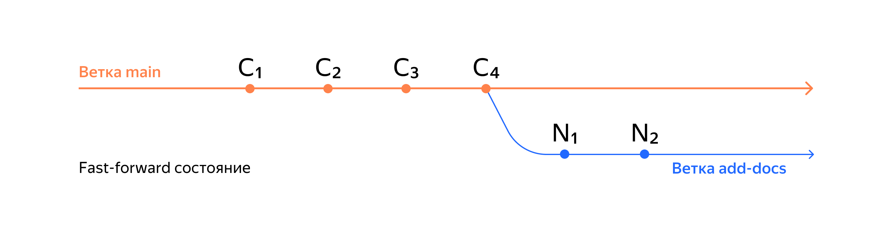
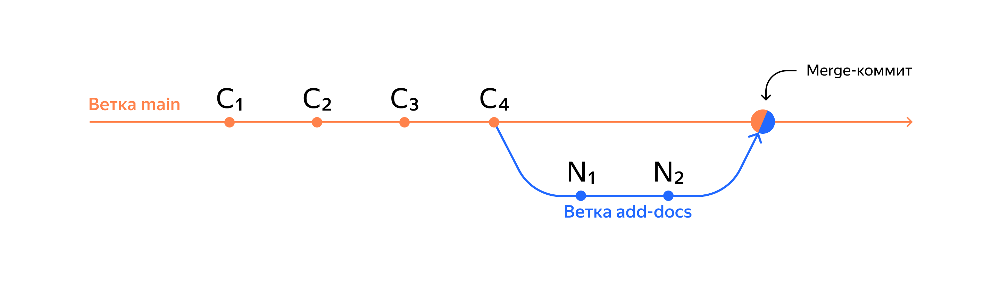
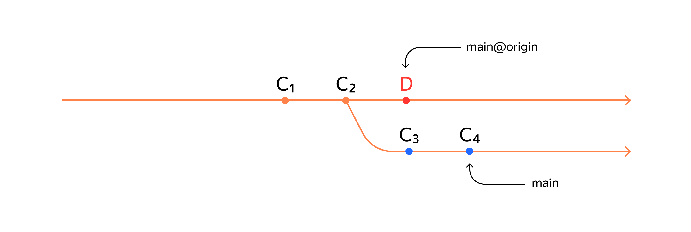

# Git
**Система контроля версии, или VCS** (**V**ersion **C**ontrol **S**ystem) - это программное обеспечение, которое помогает отслеживать изменения в программных, текстовых файлах, больших документах, веб-сайтах и так далее.<br/>
**Git** - один из примеров системы контроля версий, он позволяет хранить, изменять и анализировать историю проектов.
**Git** - незаменимый в команде инструмент, ведь он помогает объединять результаты нескольких человек. 
**Командная строка** (**C**ommand **L**ine **I**nterface, **CLI**) - тоже интерфейс, только текстовый.

---

## Команды для работы с консолью

**pwd** ( **p**rint **w**orking **d**irectory) - путь к текущей директории. 
```
$ pwd
```
**cd** (**c**hange **d**irectory) - сменить директорию. 
```
$ cd c:/
```
```
$ cd .. #переход на уровень выше
```
**ls** (**l**ist **d**irectory **c**ontents) - вывести содержимое директории
```
$ ls
```
**touch** - создать файл. 
```
$ touch newFile.txt
```
**mkdir** - создать файл. 
```
$ mkdir newDir
```
**mkdir -p ../../..** - создание целой структоры директорий
```
$ mkdir -p dir/dir-inside/dir-deeper-inside 
```
**cp** - копирование файлов
```
$ cp index.html src/
```
**mv** - перемещение файлов и директорий. 
```
$ mv newFile.txt ./newDir
```
**cat** (**c**oncatenate **a**nd **p**rint) - распечатывает, то что содержится в файле. 
```
cat newFile.txt
```
**rm** - удаление файла. 
```
$ rm newFile.txt 
```
**rmdir** - удаление директории. 
```
$ rmdir newDir 
```
Чтобы выполнить несколько команд в одной строке, нужно записывать их через **&&**. 
```
$ cd .. && touch newFile.txt && ls
```

---

## Git команды

**git version** - получение текущей версии git. 
```
$ git version
```
**git config --global user.name "..."** 
**git config --global user.email "..."** - настройка конфигурации. 
```
$ git config --global user.name "uran1a"
$ git config --global user.email "9797171z@mail.ru"
```
**cat ~/.gitconfig** - распечатывает текущую конфигурацию. 
```
$ cat ~/.gitconfig
```
**git config --list** - просмотр текущую конфигурацию. 
```
$ git config --list
```
**git init** - инициализация локального репозитория. 
```
$ git init 
```
**git status** - показывает состояние рабочего дерева. 
```
$ git status
```
**rm -rf .git** - удаление папки как репозитория. 
```
rm -rf .git 
```
**git add "..."** - подготовка файлов к сохранению
```
$ git add "newFile.txt"
```
**git add --all** - подготовка к сохранению сразу всех файлов. 
```
$ git add --all 
```
**git add .** - сохранить текущую папку. 
```
$ git add . 
```
**git commit -m "..."** - создание коммита. 
```
$ git commit -m "init: start project"
```
**git log** - просмотр истории коммитов. 
```
$ git log
```
**git log --oneline** - получение сокращенного лога. В терминале появятся *сокращенный хеш* и комментарий каждого коммита. *Сокращенный хеш* (то есть несколько символов полного) можно использовать точно так же, как и полный.
```
$ git log --oneline
cfe1e31 (HEAD -> master, origin/master) init: start project
```
Файл **HEAD** - один из служебных файлов папки .git. Он указывает на коммит, который сделан последним (то есть на самый новый).
Если нужно передать последний коммит, то вместо его хеша можно просто написать слово *HEAD* - Git поймет, что вы имели в виду последний коммит.

---

## GitHub

**GitHub** - платформа для хранения IT-проектов и совместной работы над ними с использованием Git.
**SSH** - протокол, который обеспечивает безопасностный обмен данными в сети и использует для этого ключи.
**SSH-ключ** - ваш виртуальный модификатор в GitHub. SSH-ключ состоит из двух частей - публичный и приватный. публичный ключ зашифровывает данные, а приватный - расшифровывает. 

---

**git remote add "название удаленного репозитория" "SSH или URL"** - привязка удаленного репозитория к локальному 
```
$ git remote add origin git@github.com:%ИМЯ_АККАУНТА%/first-project.git
```
**origin** (англ. «источник») — стандартный псевдоним, с помощью которого можно обращаться к главному удалённому репозиторию (обычно такой репозиторий один).

`git remote rm origin` - удаляет текущий origin. 
```
$ git remote rm origin
```

**git remote -v** - получение большей информации о выводе. Помогает убедиться, что репозитории связаны.
```
$ git remote -v
```
**git push -u "название удаленного репозитория" "название ветки"** - связывание локальной ветки с одноименной удаленной веткой. 
```
$ git push -u origin master
```


---

## Хеш - идентификатор коммита

**Хеширование** - это способ преобразовать набор данных и получить их "отпечаток" (fingerprint).
Git хеширует (преобразует) информацию о коммите с помощью алгоритма **SHA-1** (Secure Hash Algorithm - "безопастный алгоритм хеширования") и получает для каждого коммита свой уникальный *хеш - результат хеширования*. 
Если посчитать хеш одного и того же файла (одним и тем же алгоритмом) на двух разных компьютерах, то результат будет *гарантированно одинаковым*.
Все хеши и таблицы *хеш -> информация о коммите* Git сохраняет в служебные файлы. Они находятся в скрытой папке *.git* в репозитории проекта. 

## Статусы файлов в Git

- **untracked** (неотслеживаемый) - git "видит", что такой файл существует, но не следит за изменениями в нем.
- **staged** (подготовленный) - после выполнения команды *git add* файл попадает в *staging area*, то есть в список файлов, который войдет в коммит. В этот момент файл находятся в состоянии *staged*. 
- **tracked** (отслеживаемый) - в него попадают файлы, которые были зафиксированы с помощью *git commit*, а также файлы, которые были добавлены в *staging area* командой *git add*. То есть все файлы, в которых Git так или иначе отслеживает изменения.
- **modified** (измененный) - Git сравнил содержимое файла с последней сохранненой версией и нашел отличия. Например, файл был закоммичен и после был изменен.

## Conventional Commits

Conventional Commits - это простое соглашение о том, как нужно писать сообщения commit\`ов. 
Сообщения commit\`ов должны быть следующей структуры:
```
<type>[optional scope]: <descroption>
```

Commit’ы могут содержать следующие структурные элементы:
- fix: при исправляет ошибку в вашем коде. 
    ```
    init: start project
    init: start task
    ```
- feat: при добавляет новую функцию в ваш коде. 
    ```
    feat: add basic page layout
    feat: implement search box
    ```
- init: при начале проекта или задания. 
    ```
    fix: implement correct loading data from db
    fix: correct minor typos in code
    ```
- refactor: при улучшение кода, без изменения функциональности. 
    ```
    refactor: change structire of the project
    refactor: rename vars for better readabiliry
    ```
- docs: используется при работе с документацией/readme проекта 
    ```
    docs: update readme with additional information
    docs: update description of run() method
    ```

## Как исправить коммит

**--amend** рассчитан на работу c последним коммитом (HEAD). 
Дополнить коммит новыми файлами можно c помощью:

```
$ git add file.txt
$ git commit --amend --no-edit
```

Благодаря опции **--no-edit** сообщение к коммиту останется таким, каким и было.
Изменить сообщение к коммиту позволяет команда:
```
$ git commit --amend -m "Обновлённое сообщение коммита"
```

## Откат коммита, изменений, списка коммита

**git restore --staged \<file>** - убрать файл из *staging area* (убрать файл из списка "на коммит").
```
$ git restore --staged "file.txt"
```

**git reset --hard \<commit hash>** - вернуть состияние репозитория к более раннему коммиту. Более поздние коммиты потеряются!
```
$ git log --oneline
b576d89 ...
$ git reset --hard b576d89
```

**git restore \<file>** - изменения в файле «откатятся» до последней версии, которая была сохранена через *git commit* или *git add*. 
```
git restore file.txt
```

## Просмотр изменений

**git diff** - сравнивает последнюю закоммиченную версию файла с той, что находится в состоянии `modified`. 
```
$ git diff
```
**git diff --staged** - покажет изменения в `staged`-файлах относительно последних закоммиченных версий. 
```
$ git diff --staged
```
**git diff \<hash A> \<hash B>** - сравнение коммитов A и B. 
```
$ git diff 5657b5c HEAD
```

## Игнорирование файлов 

Чтобы Git игнорировать такие файлы и не пытался добавить их в репозиторий, нужно создать файл `.gitignore` и записать в него названия игнорируемых файлов. 
Просмотреть, что игнорируется, можно с помощью команды `git status --ignored`. 
Сам файл `.gitignore` - это обычный файл в репозитории. Его тоже стоит закоммитить. 
Шаблон, или правило, — это способ указать сразу на несколько файлов с однотипными названиями.

## Копирование репозиториев

### Клонирование репозиториев

Процесс копирования удаленного репозитория на локальный компьютер называется **клонированием**. 

`git clone <HTTPS | SSH key>` - копирование проекта в локальный репозиторий. Команда автоматически связывает локальный репозиторий с удаленным. 
```
$ git clone git@github.com:yandex-praktikum/git-clone-practice.git
```

**Fork** - это GitHub-операция; напрямую с Git она не связан. Fork позволяет получить точную копию GitHub-репозитория в ваш аккаунт. Копия, которая получина с помощью "форк", полностью независима от оригинального проекта - изменения *не будет синхронизированы*.

## Ветки

**Ветка** - это последовательность независимых изменений. Благодаря веткам несколько человек могут работать надо одним репозиторием и не мешать друг другу. А ещё ветки помогают декомпозировать большую страшную задачу на маленькие и понятные. 
Основная версия проекта хранится в главной ветке `main` (или `master`). 

### Команды

`git branch` - просмотр всех веток проекта и в какой из них вы сейчас находитесь. 
```
$ git branch
* master
```
`git branch <branch-name>` - создать ветку. Название ветки в Git может состоять из букв, цифр, а также включать любой из четырёх символов: ., -, _, /.
```
$ git branch feature/add-branch-info
```
`git checkout <branch-name>` - позволяет переключиться на другую ветку. 
```
$ git checkout master
```
`git checkout -b <branch-name>` - создать ветку и сразу же перейти в неё. 
```
$ git checkout -b bugfix/fix-branch
```
### Указатели в название веток

* **feature** (англ. «особенность», «деталь») для веток, где прорабатывается новая функциональность. 
* **bugfix** (от англ. bug — «жук», «ошибка» и fix — «исправить») для веток, где ведётся работа по исправлению ошибок.

Ветка указывает на коммит, который сделан в ней последним. При этом две ветки могут *ссылаться на один и тот же коммит* - например, если вы только что создали ветку, но ещё не успели внести в неё коммит. 

`git diff <branch-name1> <branch-name2>` - Git находит два коммита, на которые указывает каждая из веток, и сравнивает их. Также с веткой можно сравнить `указатель HEAD`.
```
$ git diff master feature/diff # покажет как получить feature/diff из main
$ git diff HEAD master
```
Git поддерживает суффикс навигации ~. С его помощью можно сослаться на предыдущие коммиты. 
```
$ git diff HEAD~ HEAD # вывести разницу между предыдущим и текущим коммитами
$ git diff master~3 master # вывести разницу между тем коммитом, который был три коммита назад, и текущим
```

### Объединение и удаление

`git merge <branch-name>` - выполнить слияние веток. В качестве параметра указывают название ветки, которую необходимо влить в текущую. 
```
$ git merge feature/diff
```
`git branch -D <branch-name>` - удаление ветки. 
```
$ git branch -D feature/diff
```
`git branch -d <branch-name>` - более безопастное удаление ветки. Ветка удалить только если она полность объединена с другой - то есть две ветки стали (или изначально были) частью одной истории. 
```
$ git branch -d feature/diff 
```
Удаление локальной ветки через Git не удаляет ветку на GitHub.

`git push -u origin <branch-name>` - связать локальную ветку с удаленной. 
```
$ git push -u origin master
```

## Получить изменения из удаленного репозитория 

`git pull` - забрать изменения из удаленного репозитория. необходимо перейти в локальный репозиторий и убедиться, что вы находитесь в правильной ветке.
```
$ git pull 
```
Перед созданием нового pull-request считается хорошей практикой перейти в главную ветку, "подтянуть" в нее изменения, а затем добавить эти изменения в вашу ветку с помощью merge.
Получить последние изменения из основной ветки. 
```
$ git checkout master
$ git pull # подтянули новые изменения в master
$ git checkout my-branch
$ git merge main # влили master в новую ветку my-branch 
$ git push -u origin my-branch # отправили ветку my-branch в удаленный репозиторий 
```

:warning: Обратите внимание: в процессе выполнения задания может открыться редактор кода Vim. Для выхода нажмите Esc, введите сочетание :qa! и нажмите Enter.

## Fast-forward 

Две ветки находятся в состоянии **fast-forward**, если одну из них можно "перемотать" вперёд и она будет содердать те же коммиты, что и другая. Это утверждение можно сформулировать иначе:
- при слиянии этих двух веток никак не возможен конфликт;
- истории эти двух веток не "разошлись";
- одна ветка является продолжением другой.  



Например, имеет такой репозиторий с двумя ветками (`master`, `feature/add-new-branch`).
```
$ git log --graph --oneline
* 24d8dee (HEAD -> feature/add-new-branch) feat: fiveth commit
* 9ecb54d feat: fourth commit
* 329cc08 (master) feat: third commit
* 7e0242a feat: second commit
* d877668 feat: first commit
```
Они находятся в состоянии **fast-forward**, так как истоия эти веток не "разошлись". Для того, чтобы слить ветки в состоянии **fast-forward** необходимо прописать следущие комманды:
```
$ git checkout master # сменить ветку, в которую хотите слить изменения
$ git merge feature/add-new-branch # указать ветку, с которой сливаются изменения 
Updating 329cc08..24d8dee
Fast-forward
 README.md | 2 ++
 1 file changed, 2 insertions(+)
```
Результат
```
$ git log --oneline
24d8dee (HEAD -> master, feature/add-new-branch) feat: fiveth commit
9ecb54d feat: fourth commit
329cc08 feat: third commit
7e0242a feat: second commit
d877668 feat: first commit
```
Обратите внимание:
- Ветки сливались в состоянии **fast-forward**
- В истории коммитов `HEAD` указывает и на `master` и на `feature/add-new-branch`, т.к в них сейчас одинаковые коммиты.

`git merge --no-ff <branch-name>` - отключает сливание веток с помощью fast-forward, поэтому при сливании веток будет создаться *коммит сливания* (merge commit).

```
$ git merge --no-edit --no-ff feature/add-new-branch
Merge made by the 'ort' strategy.
 docs.txt | 1 +
 1 file changed, 1 insertion(+)
 create mode 100644 docs.txt
$ git log --graph --oneline
*   6814789 (HEAD -> master) Merge branch 'feature/add-new-branch'
|\
| * 24d8dee (feature/add-new-branch) feat: fiveth commit
| * 9ecb54d feat: fourth commit
|/
* 329cc08 feat: third commit
* 7e0242a feat: second commit
* d877668 feat: first commit
```
## Форсированный пуш
`git push --force` - команда просто "выкинет" (удалит) коммит, который есть на основной ветке, но нет на текущей. 
```
$ git push --force
```

В этом случае команда `git push --force` просто «выкинет» (удалит) коммит D и запишет в `main@origin` коммиты из `main`. 
Вот что получится.


## Подходы к работе с ветками

**Подходы к работе с ветками** - это правила, которые описывают, когда и для чего создаются ветки, какие в них коммиты в какой момент происходит слияние веток. 

Три самых популярных подхода - их также принято называть **workflow** (рабочий процесс) или сокращенно: **flow**.
- **Feature branch workflow** - простой и самый популярный вариант. Если коротно, в нем для каждого нового изменения создается новая ветка, которая позже всливается в `main` с помощью `git merge`. В `main` всегда рабочая версия без "недоделок".
- **Git flow** - более сложный вариант. Подход похож на feature branch workflow, но в нем создается больше веток, а изменения (коммиты) делят на разные типы: исправление, новая функциональность и так далее. Разные типы коммитов попадают в разные ветки. 
- **Trunk-based** — популярный в больших компаниях (таких как Яндекс, Google и прочих) подход, который обещает бо́льшую скорость работы в крупных командах.
Этот подход тоже похож на feature branch workflow. Главное отличие в том, что участники проекта вливают (merge) свой код в основную ветку максимально часто. Например, каждый день.